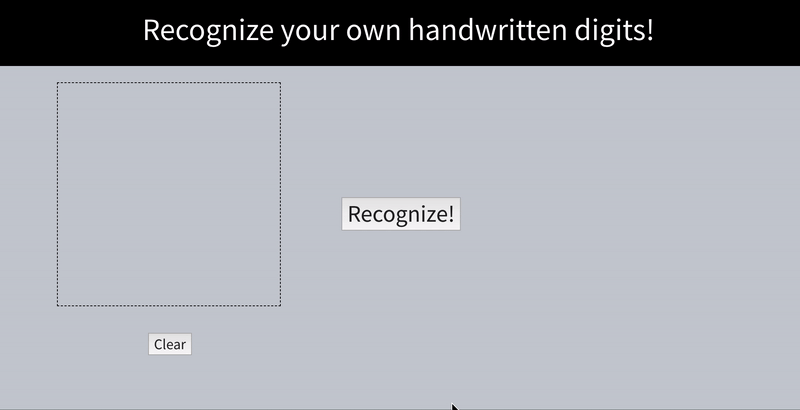

# kedr
**KE**ras-based online **D**igit **R**ecognizer

You just draw your digit by mouse, and *kedr* recognize it! Magic!

## Docker install & launch

First of all, you need to clone this repo in some folder and type in cmd from there:

```bash
$ docker build -t kedr .
```

Then it's needed to run backend:
```bash
$ docker run -it -p 5000:5000 kedr
```

To access the app you need to check out the docker container ip. For example (mac):
```
$ docker-machine ip default
192.168.99.100
```
Finally you can access the app in your browser via link:
```
http://192.168.99.100:5000
```

Have fun!


